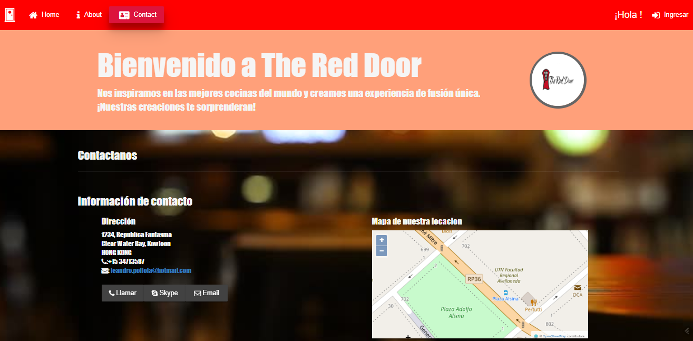
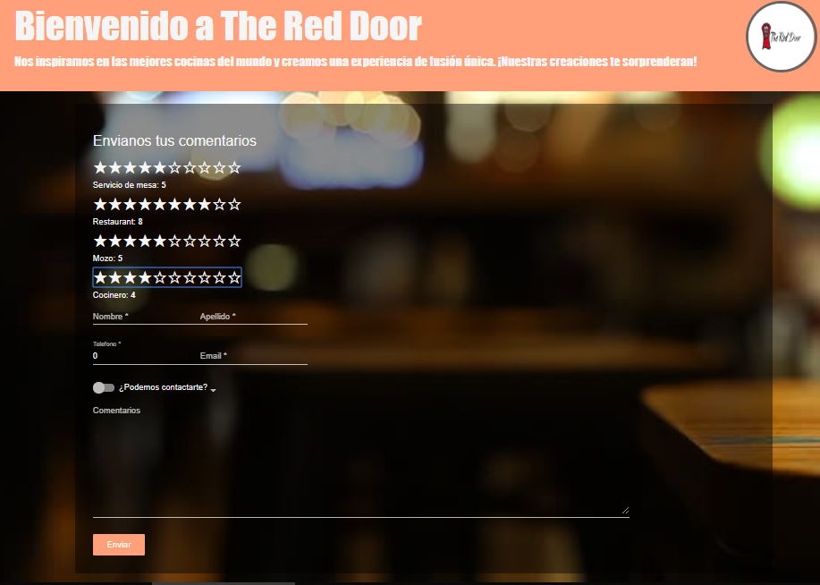

# The Red Door
Aplicación de restaurante, con ABM de empleados, pedidos y sistema de comanda para varios perfiles.

## Tecnologías utilizadas:
- Angular 6
- Angular Material
- Bootstrap
- HTML5
- CSS3
- PHP 
- MYSQL

## Perfiles de la aplicación

- Socio
- Cliente
- Mozo
- Chopera
- Tragos&Vinos
- CandyBar

## Ejecución
Correr `ng serve` para levantar Angular, navegar hacia `http://localhost:4200/`.

## Screenshots:

## - Home

## - Login 

## - Contact

## - Cliente

## - Socio 

## - Mozo 

## - Chopera 

## - Vinos y Tragos 

## - Cocina

## - CandyBar 

